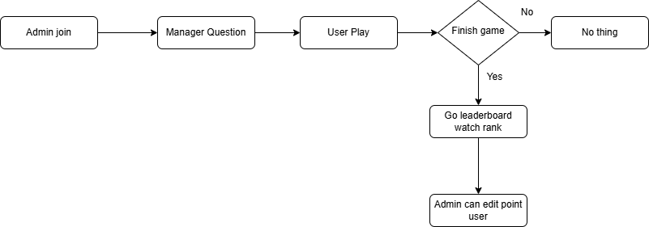

Quiz Game API Documentation

Overview

This module provides APIs to manage quiz questions and real-time score updates using Socket.IO. It supports question creation, retrieval, and score submission.

Features

Create, update, delete, and list quiz questions.

Limit the total number of questions to 10.

Players can answer questions and submit their scores.

Real-time score updates via Socket.IO when:

A player finishes a game.

An admin updates a player's score.

remember , cd to proplem 6

Installation

npm install

Environment Variables

MONGO_URI=your_mongodb_connection_string
PORT=3000

Once you install node and mongodb, run npm start

1. Leaderboard : rank user  in browser
http://localhost:3000/

2. User play game  in browser
http://localhost:3000/api/game/play 

3. admin manager questions in browser
http://localhost:3000/admin/questions

4. admin manager point in browser
http://localhost:3000/admin/Adminleaderboard

API Endpoints

1. Create a Question

POST localhost:3000/api/questions

Request Body:

{
  "questionText": "What is 2 + 2?",
  "answers": [
    { "text": "3", "isCorrect": false },
    { "text": "4", "isCorrect": true },
    { "text": "5", "isCorrect": false }
  ]
}

Response:

{
  "message": "Tạo câu hỏi thành công",
  "data": { ... }
}

Limit: Maximum of 10 questions allowed.

2. Get All Questions

GET /api/questions

Returns all stored questions.

3. Submit Score

POST localhost:3000/api/game/submit

Request Body:

{
  "username": "player1",
  "score": 7
}

Response:

{
  "message": "Score submitted successfully"
}

Triggers a real-time update via Socket.IO.

Real-time with Socket.IO

Player Score Submission Event

When a player submits a score, the server emits:

io.emit("scoreUpdated", { username, score });

Admin Score Update Event

When an admin updates a score, the server emits:

io.emit("adminScoreUpdate", { username, newScore });

Client-Side Listener Example

Players and admins can listen to score updates:

socket.on("scoreUpdated", (data) => {
  console.log("New score update:", data);
});

socket.on("adminScoreUpdate", (data) => {
  console.log("Admin updated score:", data);
});

Run the Server

diagram to illustrate the flow of execution. 

Feature & Project Improvements
1. Implement Role-Based Access Control for Admin & Users 🔐
Currently, anyone can call the API to update scores. Adding a login system will allow better access control for Admin and Users.

Example: Only Admins should be allowed to modify user scores.
2. Store Player Score History 📜
Instead of just updating the current score, save each score update in MongoDB. This will help track player progress over time.

3. Support Multiple Question Types (MCQ, Fill-in-the-Blank, etc.) 📝
Right now, the system only supports basic math questions. Expanding it to different categories such as logic, science, geography, etc., will make the game more diverse and engaging.

4. Add Multiplayer Mode 🎮
If the game can create private rooms where users compete in real-time, it will enhance the gaming experience.

5. Improve UI & UX 🎨
The leaderboard currently has a basic display. Consider adding:

User avatars
Animations & effects
Statistical charts
Personal profile pages to showcase achievements
6. Add Time Limits for Questions ⏳
To make the game more challenging, introduce a countdown timer for answering questions.

Example: Players must answer each question within 10-30 seconds, depending on the difficulty level.
7. Advanced Question Types ✅✏️
Enhance the quiz system by supporting more interactive question formats:

Checkbox (multiple correct answers)
Text input (players type their answers)
Fill-in-the-blank questions

cd project

npm start

